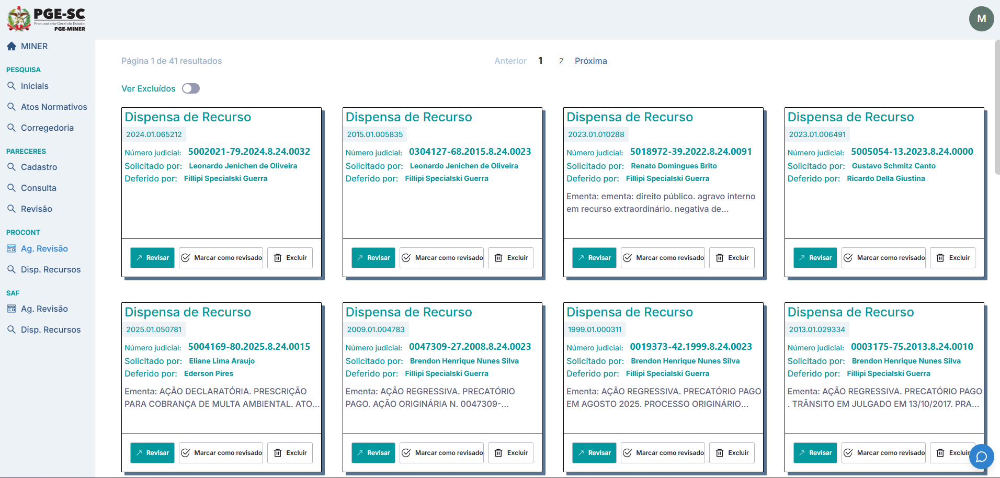
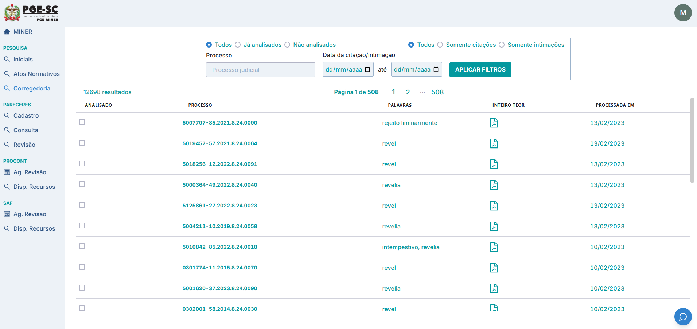
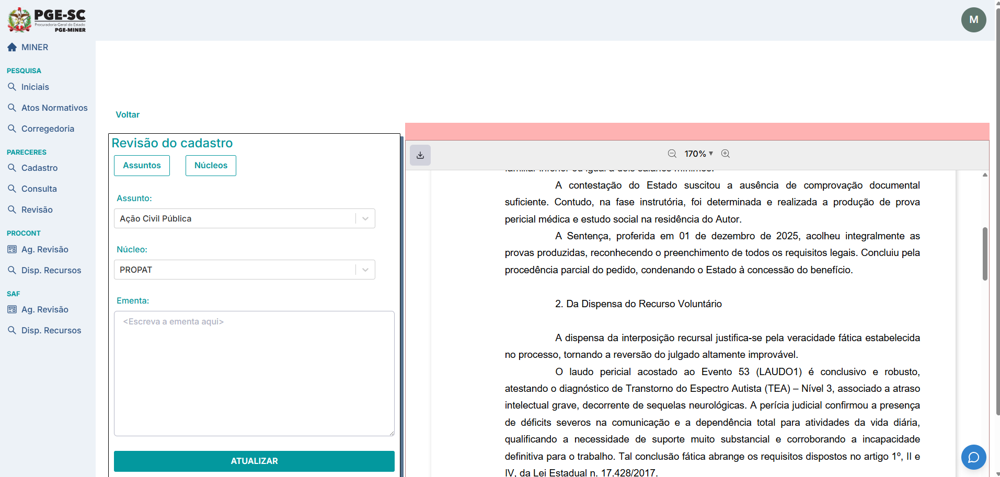
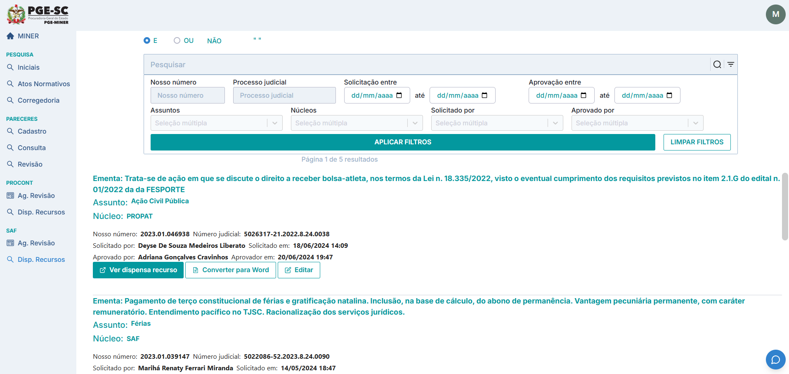
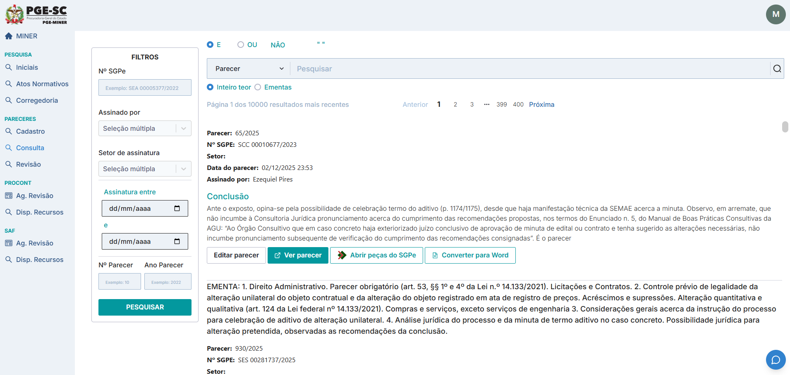
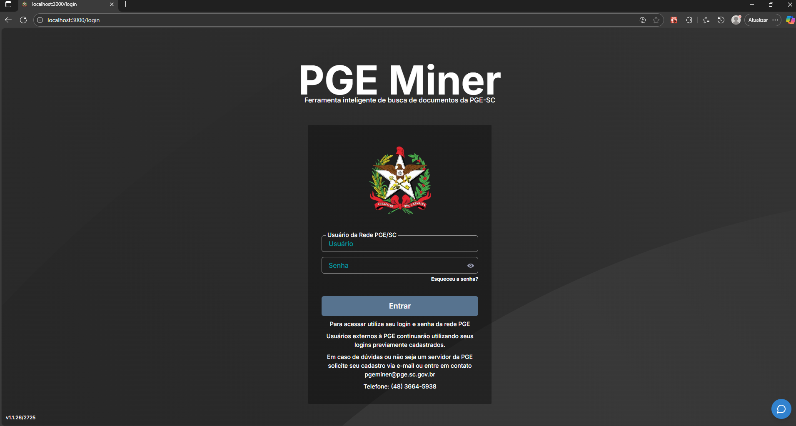

# PGE Miner — Portfólio

## Visão Geral
- Plataforma web de busca e gestão de documentos jurídicos da PGE-SC, com filtros avançados, leitura inline de PDFs e fluxos dedicados para pareceres, PROCON e SAF.
- Autenticação corporativa via LDAP (com fallback JWT) e controle de acesso integrado ao diretório interno.
- Busca full-text em Elasticsearch com filtros por datas, assinaturas, núcleos, tipos de citação/intimação e status de revisão.
- Conversões e manipulação de documentos (PDF/Word), revisão colaborativa e trilha de ações (revisar, marcar como revisado, excluir).

## Destaques Rápidos
- Pesquisas em alto volume com paginação e ordenação; visualização direta do inteiro teor (PDF).
- Módulo de pareceres com filtros SGPe, assinaturas, setores, intervalos de data e conversão para Word.
- Fluxos PROCON/SAF: gestão de “Dispensa de Recurso” com revisão e marcação rápida.
- Edição assistida de cadastro com formulário ao lado do PDF para ganho de produtividade.

## Arquitetura & Tecnologias
- **Backend:** Python 3, Django 3.2, Django REST Framework, SimpleJWT, CORS.
- **Pesquisa:** Elasticsearch 7.17 com django-elasticsearch-dsl/dsl-drf.
- **Bancos:** PostgreSQL (principal) e Oracle via `cx-Oracle` para integrações legadas.
- **Frontend:** Next.js 13 (React 18, TypeScript) com Chakra UI, React Table, React Hook Form, CKEditor 5, React-PDF-Viewer, React-Select, DatePicker, Toastify.
- **Docs/OCR:** PDFMiner, PyPDF2, pdf2image, pytesseract, pdf2docx, reportlab.
- **Infra/DevOps:** Docker/Docker Compose (dev/prod), Gunicorn (backend), servidor Node/Next (`start_prod`), variáveis de ambiente para APIs/bancos/LDAP.

## Integrações Principais
- SGPE (login, processo, tramitação, documentos via WSDL).
- EPROC 1G/2G (WSDL) para consulta e sincronização de processos judiciais.
- LDAP corporativo para autenticação e grupos.
- E-mail transacional para notificações de fluxo.

## Galeria de Telas
Imagens já organizadas em `images/` com nomes sequenciais:

- 
- 
- 
- 
- 
- 
- 

## Como Rodar (Dev)
- Backend: `docker-compose up` em `backend-miner`; criar superusuário e indexar: `python3 manage.py search_index --rebuild`.
- Frontend: `yarn install` e `yarn dev` em `frontend-miner` (ou use o `docker-compose` da raiz para subir tudo).

## Observações
- Mantenha variáveis de ambiente sensíveis (SGPE/EPROC/LDAP/bancos) fora do repositório público.
- Reindexe o Elasticsearch com `python3 manage.py search_index --rebuild` ao ingerir novos dados.
